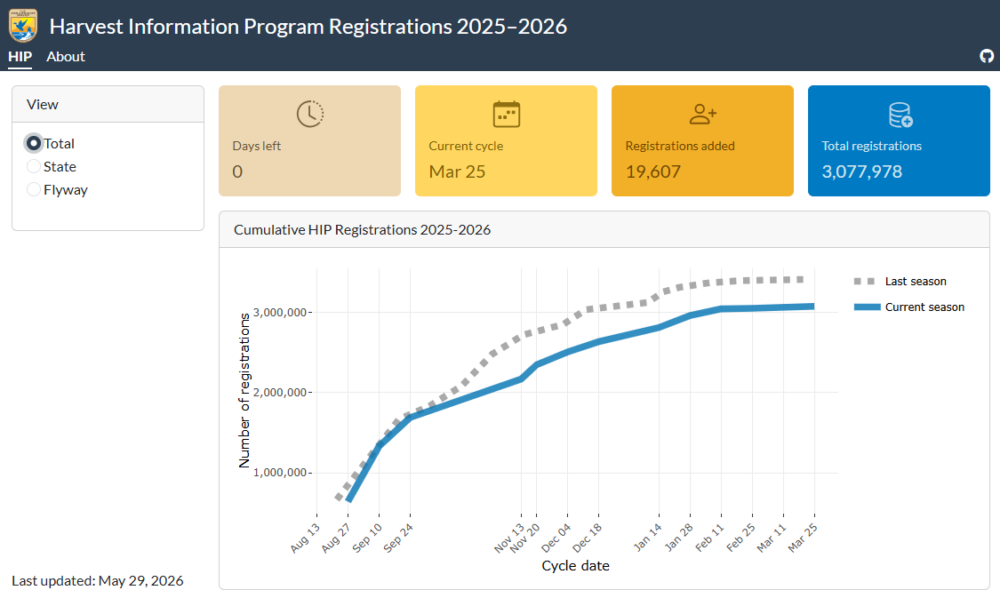

# Harvest Information Program (HIP) registration dashboard

\
View the dashboard here: <https://rconnect.chs.usgs.gov/hip-dashboard/>

This dashboard displays [Harvest Information Program](https://www.fws.gov/harvestsurvey) (HIP) registration data coarsely summarized by the U.S. Fish and Wildlife Service (USFWS). HIP registration is required for all migratory bird hunters and has been underway [since 1999](https://www.fws.gov/program/migratory-bird-harvest-surveys/about-us). The USFWS uses HIP registrations to select a small proportion of hunters to participate in the [National Migratory Bird Harvest Survey](https://www.fws.gov/harvestsurvey/surveyAbout). The Harvest Survey gathers critical information about migratory bird harvest and hunter activity that is used to set hunting season dates, hunting zones, and bag limits. Hunters have about a 5% chance of being selected to take the survey, [depending on the state](https://www.fws.gov/harvestsurvey/harvestRegistration).

HIP registration processing, sampling, mailing, and many other duties are conducted by the Migratory Bird Program [Branch of Monitoring and Data Management](https://www.fws.gov/program/migratory-bird-harvest-surveys/what-we-do).
